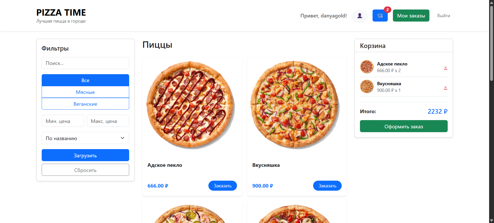
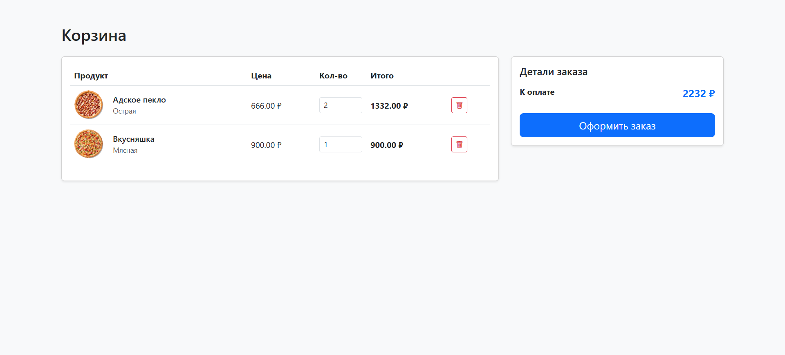
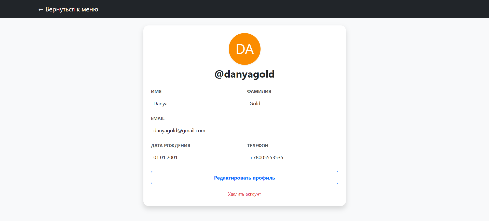
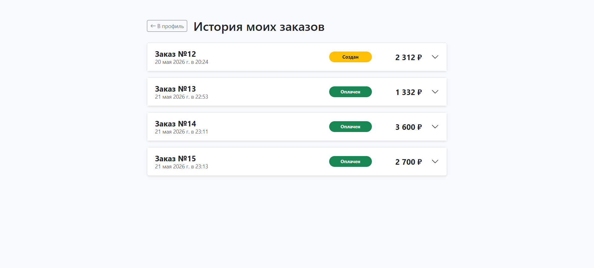

# 🍕 Pizza Time — Веб-приложение для заказа пиццы

Full-stack веб-приложение для заказа пиццы с динамическим интерфейсом, корзиной в реальном времени и интегрированной платежной системой. Проект разработан с акцентом на чистую архитектуру бэкенда, оптимизацию запросов к БД и плавный пользовательский опыт без перегрузки страниц.

## ⭐ Ключевые особенности и преимущества

* **SPA-архитектура на чистом JavaScript (Vanilla JS):** Все ключевые пользовательские сценарии (регистрация/вход, динамическая фильтрация меню, управление корзиной, обновление профиля и просмотр истории заказов) реализованы асинхронно через Fetch API. Интерфейс обновляется без перезагрузки страниц.
* **Безопасная JWT-аутентификация:** Доступ к защищенным эндпоинтам бэкенда и разделам личного кабинета реализован с помощью `django-rest-framework-simplejwt`. На стороне клиента разработаны JS-модули для изолированного управления токенами сессии.
* **Гибкое REST API с фильтрацией:** Внедрена серверная фильтрация, поиск и сортировка позиций меню благодаря интеграции пакета `django-filter` в конфигурацию Django REST Framework.
* **Интеграция с платежным шлюзом ЮKassa:** Реализован сквозной процесс обработки платежей. Бэкенд генерирует транзакции, фиксирует уникальный `payment_url` в базе данных для каждого заказа и обрабатывает финальные статусы оплаты.

---

## 🖼️ Скриншоты UI

### 🍕 Меню


### 🛒 Корзина


### 👤 Профиль пользователя


### 📦 История заказов


---

## 🏗️ Структура проекта

Проект разделен на изолированные Django-приложения для упрощения масштабирования и поддержки кода.

```text
pizza_time/
├── cart/                        # Корзина
│   ├── models.py
│   ├── serializers.py
│   └── views.py
│
├── frontend/                    # SPA-интерфейс
│   ├── index.html               # Главная страница
│   ├── cart.html                # Корзина
│   ├── history.html             # История заказов
│   ├── profile.html             # Профиль
│   ├── css/
│   │   └── style.css
│   └── js/
│       ├── auth.js
│       ├── cart.js
│       ├── history.js
│       ├── main.js
│       └── profile.js
│
├── media/
│   └── pizzas/                  # Изображения пицц
│
├── menu/                        # Каталог меню
│   ├── static/
│   ├── templates/
│   ├── models.py
│   ├── serializers.py
│   └── views.py
│
├── orders/                      # Заказы и оплата
│   ├── models.py
│   ├── serializers.py
│   ├── urls.py
│   └── views.py
│
├── pizza_time/                  # Конфигурация проекта
│   ├── settings.py
│   ├── urls.py
│   ├── asgi.py
│   └── wsgi.py
│
├── static/
├── templates/
│   └── base.html
│
├── users/                       # Пользователи и авторизация
│   ├── models.py
│   ├── serializers.py
│   ├── urls.py
│   └── views.py
│
├── .env
├── .env.example
├── .gitignore
├── db.sqlite3
├── manage.py
├── menu_data.json
└── requirements.txt
```

## 🗄️ Схема базы данных (основные сущности)
- **User** (Пользователи системы: профиль, контакты, авторизация)
- **Category** (Категории пицц)
- **Pizza** (Наименование, описание, цена, изображение, доступность)
- **Cart / CartItem** (Корзина пользователя и выбранные позиции с количеством)
- **Order / OrderItem** (Заказы, финальная стоимость, статус оплаты, фиксация товаров на момент покупки)

---

## 🛠️ Технологический стек

*   **Backend:** Python 3.12+, Django 6.0+, Django REST Framework (DRF)
*   **Библиотеки бэкенда:** `django-rest-framework-simplejwt` (JWT-токены), `django-filter` (фильтрация API), `django-cors-headers`, `django-extensions`
*   **Frontend:** Vanilla JavaScript (ES6+ Modules), Bootstrap 5, HTML5, CSS3
*   **База данных:** SQLite (для локальной разработки)
*   **Платежный шлюз:** ЮKassa SDK / API

---

## 🚀 План развития проекта (Roadmap)

- [ ] **Система лояльности:** Реализация кэшбека баллами и поддержка промокодов на бэкенде.
- [ ] **Конструктор пиццы:** Добавление функционала кастомизации (добавление/удаление отдельных ингредиентов) с динамическим пересчетом цены.
- [ ] **Интеграция очередей задач (Celery + Redis):** Вынос процессов отправки Email-уведомлений о статусах заказов в фоновые воркеры.
- [ ] **Покрытие тестами:** Написание интеграционных тестов для API корзины и эмуляции ответов платежного шлюза ЮKassa.

---

## ⚙️ Как запустить проект локально

1.  **Клонируйте репозиторий:**
    ```bash
    git clone https://github.com/DanyaGold/Pizza-Time.git
    cd Pizza-Time
    ```

2.  **Настройте виртуальное окружение:**
    ```bash
    python -m venv venv
    source venv/bin/activate  # Для Linux/macOS
    # или
    .\venv\Scripts\activate  # Для Windows
    ```

3.  **Установите зависимости:**
    ```bash
    pip install -r requirements.txt
    ```

4.  **Выполните миграции базы данных:**
    ```bash
    python manage.py migrate
    ```

5.  **Настройте переменные окружения:**
    Создайте файл `.env` в корневом каталоге проекта:
    ```env
    SECRET_KEY=your_django_secret_key
    DEBUG=True
    YOOKASSA_SHOP_ID=your_shop_id
    YOOKASSA_SECRET_KEY=your_secret_key
    ```

6.  **Запустите сервер разработки:**
    ```bash
    python manage.py runserver
    ```
    Проект будет доступен по адресу `http://127.0.0.1:8000/`.
